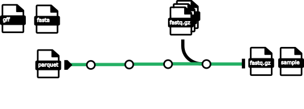

This is the repository for the nextflow pipeline to preprocess GridION fastq files and preparing a samplesheet.csv for nf-core/nanoseq DNA protocol.

The pipeline is will take an in-house parquet file with metadata (sample, replicate, barcode, and more) and together with a experiement project directory a compatible samplesheet.csv will be generated.

Expected input prarams:

*`parquetpath` - path tp parquet file of metadata

* `flowcell` - temporary for testing purposed will be retrieved from parquet in the future
* `publishDir` - location to put samplesheet.csv - merged fastq files will be in a subdirectory called `fastq_merged`

*`fasta` - path to reference fasta file

*`gtf` - path to reference fasta file

* `reference` - to be implemented: string which is the ID of strain, used to define URL to fasta and gtf 

